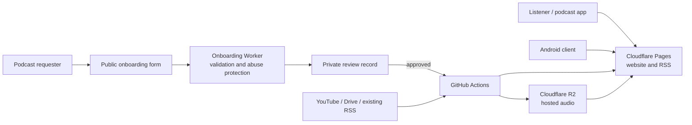

# Torah Pod public architecture

This document describes the stable, public-facing architecture. Operational
details, private intake records, credentials, and recovery procedures are kept
in the private operations repository; see [Project Governance](PROJECT_GOVERNANCE.md).



## Components

| Component | Responsibility | Public boundary |
| --- | --- | --- |
| `podcast_feeds/` | Discovery, normalization, site/RSS generation, validation. | Source and generated public output. |
| `shows/` | Public configuration for approved shows. | Never place contact details or private source links here. |
| `public/` | Generated static website, catalog, PWA shell, artwork, and feeds. | Deployed to Cloudflare Pages. |
| `workers/onboarding/` | Validates public intake requests and protects against abuse. | Returns generic status only; private request details stay private. |
| `android-wrapper/` | Android WebView client plus native audio controls. | Uses a trusted-origin prompt bridge only for `torah-pod.pages.dev`. |
| `.github/workflows/` | Synchronization, validation, publishing, monitoring, and notification automation. | Secrets are referenced by name only and never committed. |

## Content paths

### Existing feeds

Linked feeds remain hosted by their original provider. Torah Pod publishes
catalog metadata and, where configured, a compatible RSS endpoint without
copying the audio.

### Hosted shows

The synchronization workflow obtains approved source media, normalizes it,
stores it in R2, and generates the public RSS feed and site entry. Published
feeds always point to publicly reachable enclosures.

## Client behavior

- The website is a progressive web app with a service-worker cached shell.
- Audio is loaded only on listener action (`preload="none"`).
- Browser playback uses Media Session when available.
- Browser/WebView playback remembers the listener's selected volume; native
  Android playback uses the device's standard system volume controls.
- Android adds native foreground playback, notification/lock-screen controls,
  and a constrained bridge for the trusted website origin.
- The Android launch screen is dismissed only after the web app reports that
  its controls are initialized; slow starts offer a reload action instead of
  being misreported as a network failure.

## Public development checks

Run these before proposing a change:

```powershell
.\.venv\Scripts\python.exe -m unittest discover -s tests
node --test workers\onboarding\test\submit.test.mjs
.\android-wrapper\test-bridge-policy.ps1
```

For generated public output, also run:

```powershell
.\.venv\Scripts\python.exe -m podcast_feeds.build
.\.venv\Scripts\python.exe -m podcast_feeds.validate
```

Do not run a full public rebuild from an environment that cannot reach the
configured public sources: it may produce incomplete generated output.

Release Android builds must always pass explicit version values. Signed AABs
are verified and validated by bundletool as part of the build.

## Explicit non-goals for now

- No user accounts, database, cross-device synchronization, or payments.
- No collection of private onboarding information in the public repository.
- No bypass of the private approval process for publishing a show.

These are deliberate product and privacy boundaries, not missing shortcuts.
