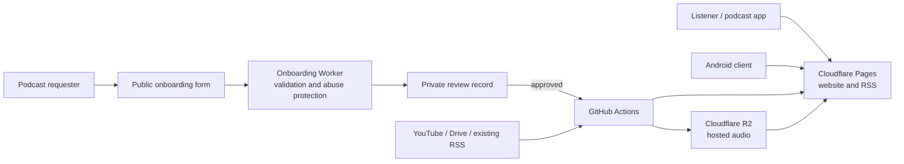

# Torah Pod public architecture

This document describes the stable, public-facing architecture. Operational
details, private intake records, credentials, and recovery procedures are kept
in the private operations repository; see [Project Governance](PROJECT_GOVERNANCE.md).


```mermaid
flowchart LR
  Listener[Listener / podcast app] --> Pages[Cloudflare Pages\nwebsite and RSS]
  Android[Android client] --> Pages
  Requester[Podcast requester] --> Onboard[Public onboarding form]
  Onboard --> Worker[Onboarding Worker\nvalidation and abuse protection]
  Worker --> Review[Private review record]
  Review -->|approved| Actions[GitHub Actions]
  Sources[YouTube / Drive / existing RSS] --> Actions
  Actions --> Pages
  Actions --> R2[Cloudflare R2\nhosted audio]
  R2 --> Pages
```

## Components

| Component | Responsibility | Public boundary |
| --- | --- | --- |
| `podcast_feeds/` | Discovery, normalization, site/RSS generation, validation. | Source and generated public output. |
| `shows/` | Public configuration for approved shows. | Never place contact details or private source links here. |
| `public/` | Generated static website, catalog, PWA shell, artwork, and feeds. | Deployed to Cloudflare Pages. |
| `workers/onboarding/` | Validates public intake requests and protects against abuse. | Returns generic status only; private request details stay private. |
| `android-wrapper/` | Android WebView client plus native audio controls. | Uses a trusted-origin prompt bridge only for `torah-pod.pages.dev`. |
| `.github/workflows/` | Synchronization, validation, publishing, monitoring, and notification automation. | Secrets are referenced by name only and never committed. |

## Content paths

### Existing feeds

Linked feeds remain hosted by their original provider. Torah Pod publishes
catalog metadata and, where configured, a compatible RSS endpoint without
copying the audio.

`public/catalog.json` intentionally remains a top-level array for existing web
and third-party clients. `public/catalog-meta.json` versions and describes that
contract for native clients. Consumers should use the show `slug` as identity,
make conditional requests with ETag or Last-Modified, and retain the last valid
catalog when a refresh fails.

### Hosted shows

The synchronization workflow obtains approved source media, normalizes it,
stores it in R2, and generates the public RSS feed and site entry. Published
feeds always point to publicly reachable enclosures.

## Client behavior

- The website is a progressive web app with a service-worker cached shell.
- Home offers recent episodes immediately, and filters followed shows before
  merging and limiting their recent episodes. Library includes followed shows,
  saved episodes, listening history and the device-local queue.
- Desktop uses a sidebar; mobile uses Home, Explore, Search, Library and Queue bottom
  navigation. Playback continues across internal navigation. The mini-player
  provides elapsed/remaining time and seeking; artwork and title both expand
  Now Playing. Browser playback also has mute and volume controls.
- Search starts with 20 playable recent episodes without loading the full search
  index. Wide screens expose episode actions and header options directly.
- Explore lists the whole podcast catalog independently of episode search.
  Android reports its system theme to trusted pages; an explicit web theme
  choice takes precedence. Native window insets keep controls below system bars.
- Appearance follows the device unless the listener selects light or dark in
  the header menu. Hebrew/English text uses a locally hosted font.
- CSS and JavaScript sources live in `podcast_feeds/web/`; the Python generator
  assembles them reproducibly into `public/assets/`.
- `metadata/v1/latest.json` contains a bounded latest list for each show;
  `metadata/v1/shows/<slug>/<page>.json` serves 20-episode pages. The full
  search index loads when a listener searches. Existing episode URLs and the
  top-level `catalog.json` array remain stable.
- Failed linked-feed refreshes retain validated previous public metadata.
- Follows, saves, progress and queue currently remain on the listener's device.
  Anonymous listening does not require an account. Private API requests and
  requests with authorization headers are excluded from service-worker caching.
- Audio is loaded only on listener action (`preload="none"`).
- Browser playback uses Media Session when available.
- Browser/WebView playback remembers the listener's selected volume; native
  Android playback uses the device's standard system volume controls.
- Android adds native foreground playback, notification/lock-screen controls,
  and a constrained bridge for the trusted website origin.
- The Android launch screen is dismissed only after the web app reports that
  its controls are initialized; slow starts offer a reload action instead of
  being misreported as a network failure. It also exposes the installed version
  name/code, and recreates the activity if Android kills the WebView renderer.
- Scheduled production checks validate every Torah Pod-hosted RSS feed and the
  newest enclosure's one-byte range response. Availability email is sent only
  when the monitor changes between healthy and failing, including recovery.

## Public development checks

Run these before proposing a change:

```powershell
.\.venv\Scripts\python.exe -m unittest discover -s tests
node --test workers\onboarding\test\submit.test.mjs
.\android-wrapper\test-bridge-policy.ps1
```

For generated public output, also run:

```powershell
.\.venv\Scripts\python.exe -m podcast_feeds.build
.\.venv\Scripts\python.exe -m podcast_feeds.validate
```

For a site-only rebuild using previously validated public metadata, set
`TORAH_POD_OFFLINE_BUILD=1`. Missing cached sources require a connected build.

Release Android builds must always pass explicit version values. Signed AABs
are verified and validated by bundletool as part of the build. The build starts
from clean package intermediates so a previously interrupted run cannot be
mistaken for a valid current artifact.

## Explicit non-goals for now

- No user accounts, database, cross-device synchronization, or payments.
- No collection of private onboarding information in the public repository.
- No bypass of the private approval process for publishing a show.

These are deliberate product and privacy boundaries, not missing shortcuts.
